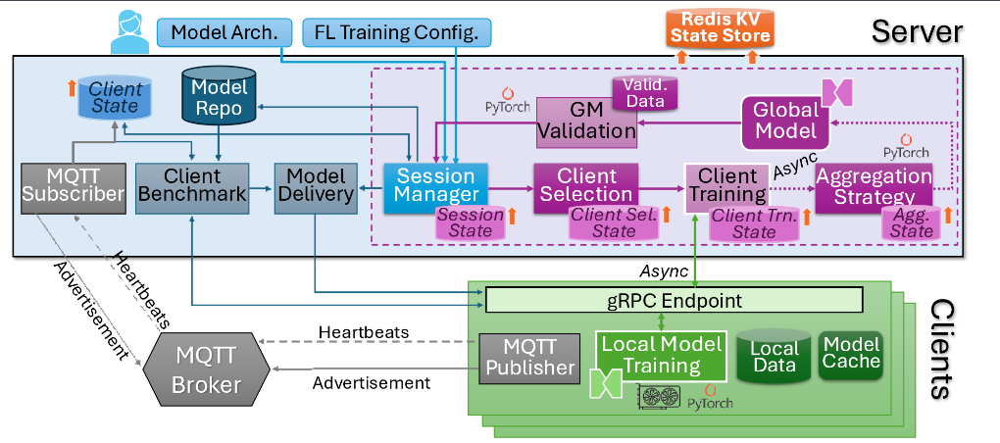

# Flotilla: A Scalable, Modular and Resilient Federated Learning Framework for Heterogeneous Resources
Flotilla is a federated learning framework that is designed to be extensible and deployed on a wide range of devices. Written in Python, it allows you to plug in your own client selection strategies, aggregation strategies and models with minimal lines of code. A number of popular FL strategies are provided out of the box. Flotilla is available under an Apache 2.0 license.


## Credits
Flotilla has been developed at the [DREAM:Lab](https://dream-lab.in), [Indian Institute of Science, Bangalore](https://iisc.ac.in), in collaboration with [BITS Pilani-Hyderabad](https://www.bits-pilani.ac.in/hyderabad/manik-gupta/).

* **Citation:**
"Flotilla: A Scalable, Modular and Resilient Federated Learning Framework for Heterogeneous Resources", [Roopkatha Banerjee](mailto:roopkathab@iisc.ac.in), Prince Modi, Jinal Vyas, Chunduru Sri Abhijit, Tejus Chandrashekar, Harsha Varun Marisetty, Manik Gupta and [Yogesh Simmhan](mailto:simmhan@iisc.ac.in), *Journal of Parallel and Distributed Computing (JPDC)*, Volume 203, September 2025, Elsevier [doi](https://doi.org/10.1016/j.jpdc.2025.105103) [arxiv](https://arxiv.org/abs/2507.02295)

---
## Features

* **Extensibility:** Flotilla is designed to be extensible, so you can easily add your own custom components, such as:
    * *Client selection strategies:* These strategies determine which clients will participate in each round of training.
    * *Aggregation strategies:* These strategies combine the model updates from the clients into a single update for the global model. Both synchronous and asynchronous strategies are supported. E.g., TiFL, FedAT, FedAvg, FedAsync.
    * *Models:* Flotilla supports any PyTorch model, so you can use it to train a wide range of machine learning models.

* **Ease of use:** Flotilla is easy to set up and use, even if you are new to federated learning. It provides a simple API for training and evaluating models, and it comes with a variety of example applications.

* **Portability:** Flotilla can be run on a wide range of devices, from Raspberry Pis to GPU workstations to Cloud VMs. This makes it ideal for a variety of use cases, such as training models on mobile devices or on edge devices. It can also be run in a Dockerized environment with the server and clients running as containers.

* **Scalability:** Flotilla has been tested on 1000+ deployments of Docker clients. It's clients are stateless and the leader can be checkpointed and restored.

---
## Design


Flotilla consists of a leader and a set of clients. The *leader* runs on a central server or a cloud VM while the *clients* run on various edge devices or machines hosting local training data. Clients advertise their availablity for FL training, their resource capacity and dataset details through an MQTT topic. When a user starts a FL session, they pass the model file and configuration to the leader. The leader selects clients for the first round of training based on the configured client selection strategy, and ships the models to the clients (if required). One round of training occurs at the clients. If using a sync FL strategy, aggregation happens at the leader after all clients report their local model to it, and the configured aggregation strategy is performed to get the global model. Another round of client selection by the leader and local training at those clients then occurs. This repeats for a certain number of training rounds or a quality threshold is reached, before the session stops at the leader. Clients are stateless and only require the local training data, Flotilla client scripts and model training framework (e.g., PyTorch) to be present. The leader is stateful and persists the session state to a local file for checkpointing or to a Redis store.

---
---
## Note
Flotilla has been tested with Python 3.6.15 and above.

## Bare Metal Installation

This installation is for a bare-metal distributed setup where the server and each client is running on different machines. First, make sure you have Python and  all the related dependencies like GCC installed. You can follow these steps:

1. Clone the repo into your respective server and client machines:
    ```bash
    git clone git@github.com:dream-lab/flotilla.git
    cd flotilla
    ``` 
2. Use the following command to install the required dependencies from the `requirements.txt` file using pip:
    
    The Client and the Server directories contain their own set of requirement files, based on what you plan to use, run the following command.

    For the server run:
    ```bash
    pip install -r src/server/requirements.txt
    ```

    For the client run:
    ```bash
    pip install -r src/client/requirements.txt
    ```

3. We also recommend regenerating the `proto` files to match the version of python installed.

    To regenerate the `proto` files, run the following command.
    ```bash
    cd src/proto && bash run.sh
    ```

#### For Nvidia Jetson devices please make sure to install torch and torchvision as per your device's configuration. Please refer <a href="https://forums.developer.nvidia.com/t/pytorch-for-jetson/72048" target="_blank">here.</a>

## Quick Setup
To test a sample Federated Learning (FL) workflow, follow these instructions for running the Flotilla server and one Flotilla client on the same machine to train the FACNN model on CIFAR10_IID.

After cloning the GitHub repository, install the necessary requirements for both the server and the client. Optionally, regenerate the protocol buffers. Then, download and unzip the following file

```bash
wget "https://www.dropbox.com/scl/fi/2oozukii5zvkt8643iohk/flotilla_quicksetup_data.zip?rlkey=1nkwzif43zpu3o9h46ismrxe2&st=7wa25qdm&dl=0" -O flotilla_quicksetup_data.zip
unzip flotilla_quicksetup_data.zip
mv data src/
mv val_data src/
```

To run the MQTT Broker and the Redis server, use the following command:
```bash
cd docker && docker-compose up -d
```

On two different terminals, run the following:
```bash
cd src && python flo_client.py
```
and
```bash
cd src && python flo_server.py
```

To start the training session, on a third terminal run:
```bash
cd src && python flo_session.py ../config/flotilla_quicksetup_config.yaml --federated_server_endpoint localhost:12345
```

## Full Configuration
The project contains various configuration files that control different aspects of the training and communication process. These configuration files can be found in the config directory. Details of what parameters these configuration files need to contain are present in [README.md](config/README.md)

* `training_config.yaml`: Contains settings related to the training session, benchmark, and training process.
* `server_config.yaml`: Configures the communication settings for the server.
* `client_config.yaml`: Configures the communication settings for the client.
* `logger.conf`: Sets up loggers, handlers, and formatters for the project.

Please make sure to review and modify these configuration files according to your specific use-case before running the application.Once the configurations are set, copy `server_config.yaml`, `client_config.yaml` and `logger.conf` to `src/config`
Before running the server and client, make sure to configure the MQTT settings correctly. Open the `server_config.yaml` and `client_config.yaml` file and locate the `mqtt` section. Update the fields to point to the appropriate MQTT broker. It should look something like this:

   ```yaml
   mqtt:
     mqtt_broker: <mqtt_broker_ip>
     mqtt_broker_port: <mqtt_broker_port>  # Adjust the port if necessary
   ```
### Configuration of the server
On the server, you also need to configure the Redis port in `server_config.yaml`. If you want Flotilla to run using Redis, configure:
   ```yaml
   state:
    state_location: redis
    state_hostname: <redis_server_ip>
    state_port: <redis_server_port>
   ```
If you want Flotilla to run without Redis, with the states being maintained in-memory, configure:
   ```yaml
   state:
    state_location: inmemory
    state_hostname: None
    state_port: None
   ```

Once you have configured the server and client configuration yaml files, copy the configs to `src/config`.

On the server, do:
```bash
mkdir src/config
cp server_config.yaml src/config/
cp logger.conf src/config/
```

You need to add the model you want to train on the server. We have a set of predefined models in [models](models/) directory. Copy the model you want to train to `src/models`. If you want to define a new model, follow the instructions in [README.md](models/README.md). Remember to update the `training_config.yaml` with the correct model name and model directory.

```yaml
server_training_config:
  model_dir: <model_directory>
  validation_dataset: <validation_dataset_ID>
```

You also need to configure the model configurations in `training_config.yaml`

```yaml
model_config:
  use_custom_dataloader: <True or False>
  custom_loader_args: <Any custom arguments to the dataloader or None>

  use_custom_trainer: <True or False>
  custom_trainer_args: <Any custom arguments to the trainer or None>

  use_custom_validator: <True or False>
  custom_validator_args: <Any custom arguments to the validator or None>

  model_args: <Any custom arguments to the model or None>
```

Finally, you need to add the validation data in `src/val_data` of the server.
```bash
mkdir src/val_data/<validation_dataset_id>
```

Add a `dataset_config.yaml` to the `src/val_data/<validation_dataset_id>` directory with the following parameters:
```yaml
dataset_details:
  data_filename: <path_to_the_data_file>
  dataset_id: <validation_dataset_id>
  dataset_tags: <dataset_tags or None>
  suitable_models: <list_of_model_ids or None>
metadata: 
  label_distribution: <dictionary_of_label_distributions or None>
  num_items: <number_of_datapoints_in_validation_dataset>
```

### Configuration of the client

Once the `client_config.yaml` is configured, do:

```bash
mkdir src/config
cp client_config.yaml src/config/
cp logger.conf src/config/
```

You also have to set up the data folder on the clients in `src/data`. 
```bash
mkdir src/data/<train_dataset_id>
```

Add a `train_dataset_config.yaml` to the `src/data/<train_dataset_id>` directory with the following parameters:
```yaml
dataset_details:
  data_filename: <path_to_the_data_file>
  dataset_id: <train_dataset_id>
  dataset_tags: <dataset_tags or None>
  suitable_models: <list_of_model_ids or None>
metadata: 
  label_distribution: <dictionary_of_label_distributions or None>
  num_items: <number_of_datapoints_in_train_dataset>
```

Make sure that the `dataset_id` is the same as that defined in `train_config.yaml` on the server.

### Running the server and clients

Before running any experiments, ensure you have an MQTT broker up and running for the server and clients to communicate. We have built on the default configuration provided by the <a href="https://hub.docker.com/_/eclipse-mosquitto" target="_blank">eclipse-mosquitto</a>'s official docker image.

To run the MQTT Broker, use the following command:
```bash
cd docker && docker-compose up -d
```

The project consists of two main entry points:


Add the model you want to train . If you want to add a custom model, add a model in `src/models` on the server. The instructions for how to add a new model are in [src/]

1. [flo_server.py](src/flo_server.py)

   `flo_server.py` is the entry point into the code from the server side. It starts the server and manages the federated learning process, model updates, and communication with the clients.
   
   To run the server application, use the following command:
    ```bash
    cd src && python flo_server.py
    ```

3. [flo_client.py](src/flo_client.py)

    `flo_client.py` is the entry point into the code from the client side. It initiates the client application and handles the client-side communication, training, and other relevant functionalities.

    To run the client application, use the following command:
    ```bash
    cd src && python flo_client.py
    ```

    #### We provide a flag with the entry-points to log the usage details of the device's CPU/RAM/Disk IO/Network IO. It is set to `False` by default. 

    Use to following command to enable it:

    ```bash
    python flo_server.py -m
    python flo_client.py -m
    ```
4. Once you have the client and server running, you can start a training session by passing a configuration file to flo_session. You can use one of our default configuration files, details of which are provided in [README.md](config/README.md). 

    ```
    python flo_session.py <training_configuration> --federated_server_endpoint <server_ip>:12345

    ```
---
---
## Docker Installation
This installation is for a bare-metal distributed setup where the server and each client is running on Docker containers.

### Clone the Repository

```bash
git clone git@github.com:dream-lab/flotilla.git
cd flotilla
```

### Build the containers

Build the server and client images.
```bash
docker build -f docker/Dockerfile.server -t flotilla-server .
docker build -f docker/Dockerfile.client -t flotilla-client .
```

Make a docker network for the containers to attach to.
```bash
docker network create -d bridge flotilla-network
```

### Start the MQTT and Redis containers
Once the server and client containers are built, start the MQTT and Redis containers. Configure the correct mqtt and redis IP and ports in `docker/docker-compose.yml`

```bash
cd docker
docker-compose up -d
```

### Run the client containers
The `sample_docker_client_run.sh` file is a sample file that starts a number of client containers. It starts a number of client containers in a for loop. Please set the following parameters correctly in the `docker run` command

* `--network`: Put in the correct network for the container to join. If you executed the command for creating the docker network above, it will be `flotilla-network`. If you are running clients across different machines, you will need to create a docker swarm and define a network overlay.
* `--memory`: Optionally, set the amount of memory allowed per container.
* `--cpuset-cpus`: Optionally, bind the container to a CPU core.
* `--mount`: We need to bind two directories, one with the client's data to `/src/data` and the other is where the client logs will be generated to `/src/logs`. 

Once these parameters are set correctly, please run the bash file to get the client containers running.

```bash
bash sample_docker_client_run.sh
```

### Run the server container
The `sample_docker_server_run.sh` file is a sample file that runs the Flotilla server. Please set the following parameters correctly in the `docker run` command.

* `--network`: Put in the correct network for the container to join. If you executed the command for creating the docker network above, it will be `flotilla-network`. If you are running clients across different machines, you will need to create a docker swarm and define a network overlay.
* `--env`: Set the the `REDIS_IP`, `REDIS_PORT`, `MQTT_IP` and `MQTT_PORT` correctly, replacing it;  with the IP of the system which have these containers running.
* `--memory`:  Optionally, set the amount of memory allowed for the container.
* `--mount`: We need to bind four directories: the directory where the server logs are to be stored is to `\src\logs`, the directory with the server-side validation data to `\src\val_data` if the path is left untouched in the `server_config.yaml`, the directory to store the checkpoints to `\src\checkpoints` if the path is left untouched in the `server_config.yaml` and the directory with the model definitions to `/src/models`.

Once these parameters are set correctly, please run the bash file to get the server container running.

```bash
bash sample_docker_client_run.sh
```

### Running the session
Once the server and the clients are running, run the `/src/flo_session.py` file with the correct configuration file and the server IP address.

```bash
cd src
python flo_session.py <path_to_config> --federated_server_endpoint <server_ip>:<server_port>
```

This should sucessfully start the session.

---
---
## License and Copyright
This code is released under Apache License, Version 2.0
https://www.apache.org/licenses/LICENSE-2.0.txt

Copyright (c) 2025 DREAM:Lab, Indian Institute of Science. All rights reserved.
